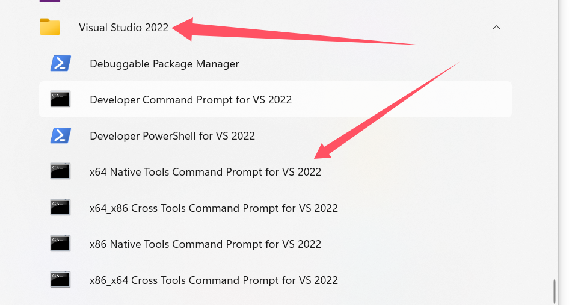

### 需要注意的是：msvc要使用vs自带的prompt来运行cl.exe.

### 然后windows下安装rust默认也是使用的msvc版本



```shell
D:\Git\CWithRust\windows\msvc\RustCallC\bindgen>rustup show
Default host: x86_64-pc-windows-msvc
rustup home:  C:\Users\yyjeqhc\.rustup

installed toolchains
--------------------

stable-x86_64-pc-windows-msvc
nightly-x86_64-pc-windows-msvc (default)

installed targets for active toolchain
--------------------------------------

aarch64-pc-windows-msvc
aarch64-unknown-linux-gnu
wasm32-unknown-unknown
x86_64-pc-windows-gnu
x86_64-pc-windows-msvc

active toolchain
----------------

nightly-x86_64-pc-windows-msvc (default)
rustc 1.87.0-nightly (f04bbc60f 2025-02-20)


```

